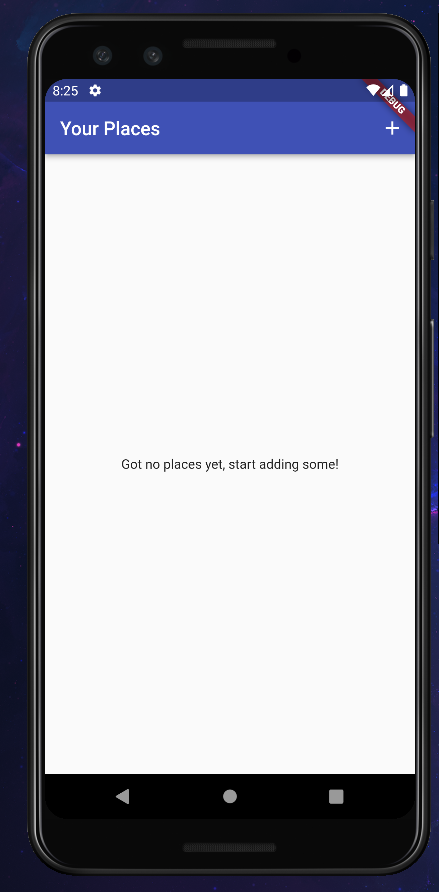
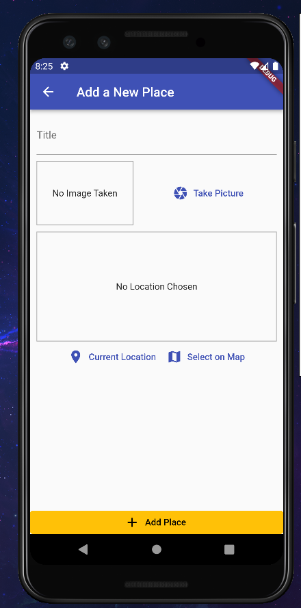
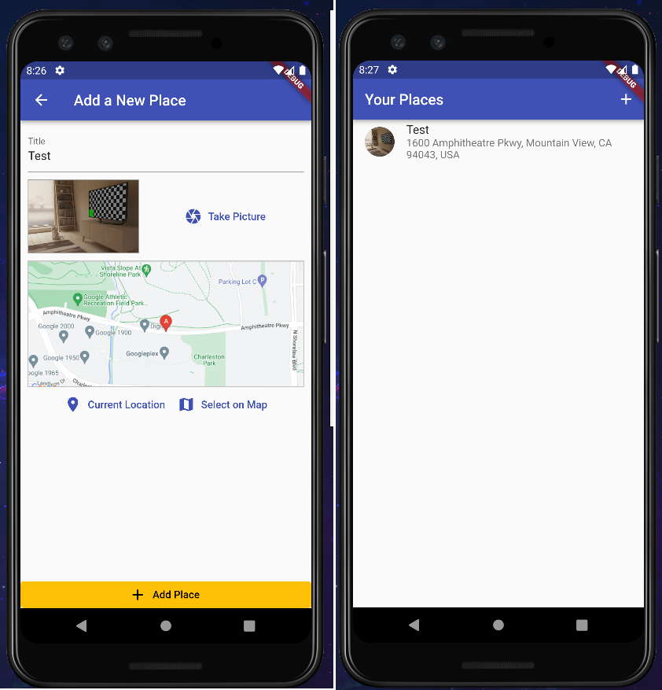
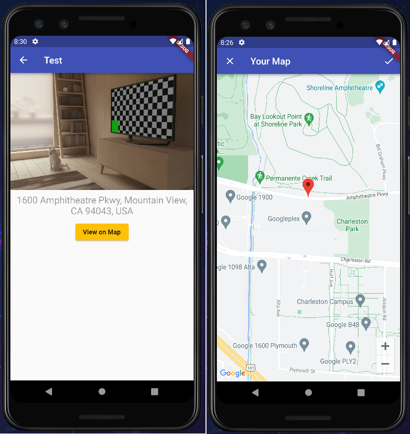

# Great Places App

An mobile app where you are able to add place, give it name, take picture using your mobile camera, and select location using your current location or select location from map. Your places are stored in your memory.

Technologies used to develop app:
- Flutter
- SQLite

I used Google Maps Platform for Maps.

## Overview Screen

## Add Place Screen

## Added Place

## Place Details

